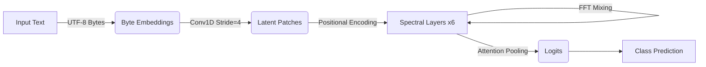

# Spectral-JAX: Byte-Level Universal Transformer

**Spectral-JAX** is a high-performance, JAX/Flax-based implementation of a **Spectral State Space Model (SSM)** designed for **Universal Input Processing**. 

Unlike traditional Transformers that rely on complex, language-specific tokenizers (BPE, WordPiece), Spectral-JAX operates directly on **Raw UTF-8 Bytes**. It uses a novel **Byte-Level Patching** mechanism to compress long byte sequences into dense latent representations, enabling it to model complex hierarchical structures (like mathematical operations or code) and natural language with a single, unified architecture.

## 🚀 Key Features

*   **Byte-Level Tokenization**: No vocabulary limits. Handles any text, code, or binary data by reading raw bytes (0-255).
*   **Patching Architecture**: Uses Strided 1D Convolutions to compress byte sequences (e.g., 2048 bytes -> 512 patches), maintaining computational efficiency.
*   **Spectral Filtering**: Leverages FFT (Fast Fourier Transform) based layers for efficient long-range dependency modeling.
*   **Attention Pooling**: Implements a learnable query mechanism to focus on the most relevant parts of the sequence for classification.
*   **JAX/Flax Optimized**: Built for speed and TPU/GPU acceleration with `optax` for optimization.

## 🧠 Architecture Overview

The model follows a 4-stage pipeline:

1.  **Byte Encoder**: Converts raw bytes to embeddings.
2.  **Patching Layer**: Compresses the sequence length by 4x using a Strided Convolution, effectively creating "visual words" from bytes.
3.  **Spectral Backbone**: A stack of layers that mix information globally using FFTs and locally using Gated Linear Units (GLU).
4.  **Attention Head**: Aggregates the sequence into a single classification vector using Attention Pooling.



## 🛠️ Installation

```bash
# Clone the repository
git clone https://github.com/yourusername/spectral-jax.git
cd spectral-jax

# Install dependencies
pip install -r requirements.txt

# For GPU support (L4/A100 recommended)
pip install --upgrade "jax[cuda12]" -f https://storage.googleapis.com/jax-releases/jax_cuda_releases.html
```

## 🚦 Usage

### Training on ListOps (Long Range Arena)

To train the model on the LRA ListOps dataset:

```bash
# Recommended for 24GB VRAM GPUs (e.g., L4, 3090, 4090)
TF_GPU_ALLOCATOR=cuda_malloc_async python3 run_lra.py
```

**Configuration (`config.py`):**
*   `seq_len`: 2048 (Bytes)
*   `batch_size`: 16 (Physical) / 128 (Effective with Gradient Accumulation)
*   `learning_rate`: 1e-4
*   `dropout`: 0.2

## 🗺️ Roadmap

- [x] **Phase 1: Architecture Design**
    - [x] Implement Byte-Level Tokenizer
    - [x] Implement Strided Convolution Encoder
    - [x] Integrate Spectral Layers

- [x] **Phase 2: Stability & Optimization**
    - [x] Fix OOM issues with Gradient Accumulation
    - [x] Implement Attention Pooling
    - [x] Add Label Smoothing & Stronger Regularization

- [ ] **Phase 3: Universality (Current Focus)**
    - [ ] Train on ListOps (Hierarchical Data)
    - [ ] **Next:** Train on IMDB (Natural Language) *without changing the model*
    - [ ] **Next:** Train on Python Code (Syntax Classification)

- [ ] **Phase 4: Scaling**
    - [ ] Scale to sequence lengths of 8k - 16k
    - [ ] Implement FlashAttention or similar memory optimizations

## 💡 Use Cases

### 1. Universal Text Classification
Since the model reads bytes, it works out-of-the-box for **any language** (English, Chinese, Turkish, Emoji) without needing a new tokenizer or vocabulary.

### 2. Code & Log Analysis
Ideal for processing server logs, stack traces, or source code where special characters (`{`, `}`, `\n`, `\t`) carry significant structural meaning that standard tokenizers might discard or split poorly.

### 3. Biological Sequence Modeling
Can directly process DNA (ATCG) or Protein sequences as raw character bytes to predict properties or functions.

### 4. Hierarchical Data Parsing
Proven effectiveness on the **ListOps** task demonstrates the model's ability to parse and evaluate nested mathematical expressions (e.g., `(MAX 2 (MIN 3 1))`), a capability often lacking in standard RNNs/CNNs.
